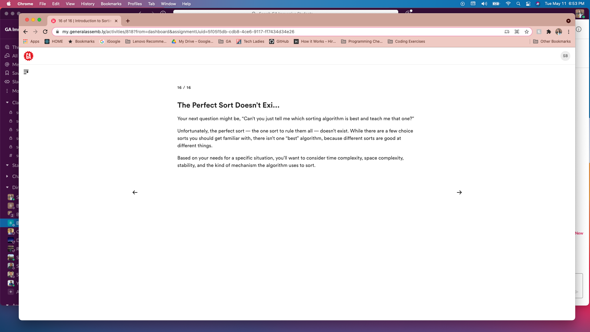

# myGA-2
Log into https://my.generalassemb.ly/

- Within the Algorithms section, do:
  - Introduction to Sorting
  
  - Basic Sorting Algorithms
  
  - Divide-and-Conquer Sorting Algorithms
  
  - Distribution Sorting Algorithms
  
  - Search Algorithms
  

For each section, take a screencap of the final slide of that section. Put those screencaps into this folder, add & commit them, push them up to your branch, and make your pull request.